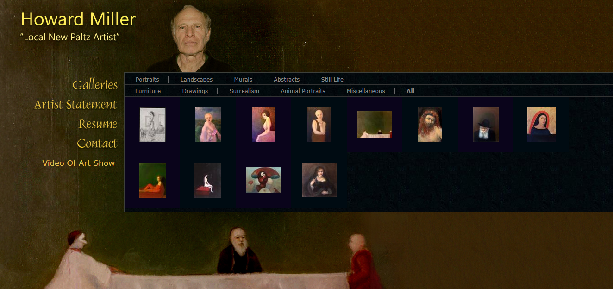

I made this website for my Dad's friend to showcase his art all the way in 2009, and I did not even put it up in my original portfolio, because it was such an old rudimentary website, and it was one of my first websites I've ever made. There was a reason for that. It was rudimentary, it used antiquated technology & jQuery.

But then something changed. See, everybody was paying all of this money annually for hosting, and nobody really wanted to pay. I proposed the idea of putting it on Github.io, as it was a static website.

I had to change all of the parts that had PHP into all JavaScript, and you can bet I absolutely had a blast using 2020-2021 Javascript idioms like Filter/Map/Reduce/Some and all of that as well as arrow functions. 

Since Microsoft was super generous to allow people to put up their portfolio online for free like you're doing right now (so long as it's static without PHP), we have a happy customer in Howard Miller who now has his static site up for all to see, after I proposed that Github idea to him.


I just really had to change the Filter part of the categories of art, which formerly used PHP, and I used vanille Javascript to dynamically create the overlay when clicking on the artwork rather than relying on the previous library called Facebox. For some reason when I originally did it it was using PHP, but since this was github.io (no PHP/Perl/Python), it was all javascript. Worked out great!



```js
async function filter(jsartattribute, jsartvalue) {
    hovercounter = 0;;

    //get json at miller_art.json in plain javascript
    miller_json = await $.getJSON("miller_art.json");
    //filter the json so the jsartvalue is equal to ANY inside the type attribute
    //use ES6 Arrow Functions
    var filtered_json = miller_json.filter(item => item["type"].some(i => i == jsartvalue));
    if(jsartvalue == "all"){
        filtered_json = miller_json;
    }

    $("#mainContent").bind('mouseover', function() {
        hovercontent();
    });

    filtered_html = '';
    for (var i = 0; i < filtered_json.length; i++) {
        item = filtered_json[i];
        id = item["id"];
        description = item["description"];
        filtered_html += `<div class="picturediv"><a href="javascript:generate_center_overlay(${id},'${description}')" class="" border=0><div class="colorbackground"></div><div style="text-align: center"></div></a></div>`;
    }

    $("#gallerydiv").html(filtered_html);

    maincontent("galleries");
    
    transitions();
    //if img doesn't load, delete the picturediv
    $("#gallerydiv img").bind('error', function() {
        $(this).parent().parent().parent().remove();
    });
    setTimeout("$('.imageclickable').each(function () {verticalalign(this);});", 200);
}

```